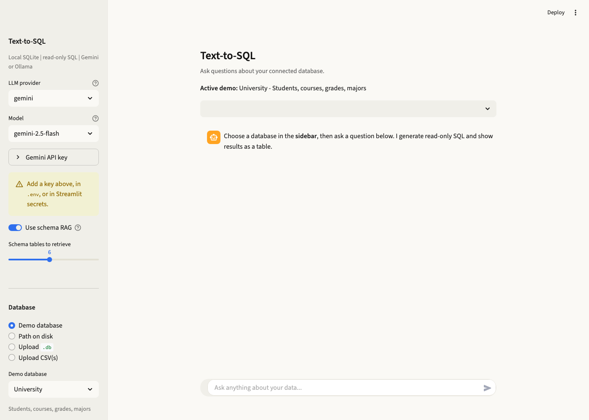
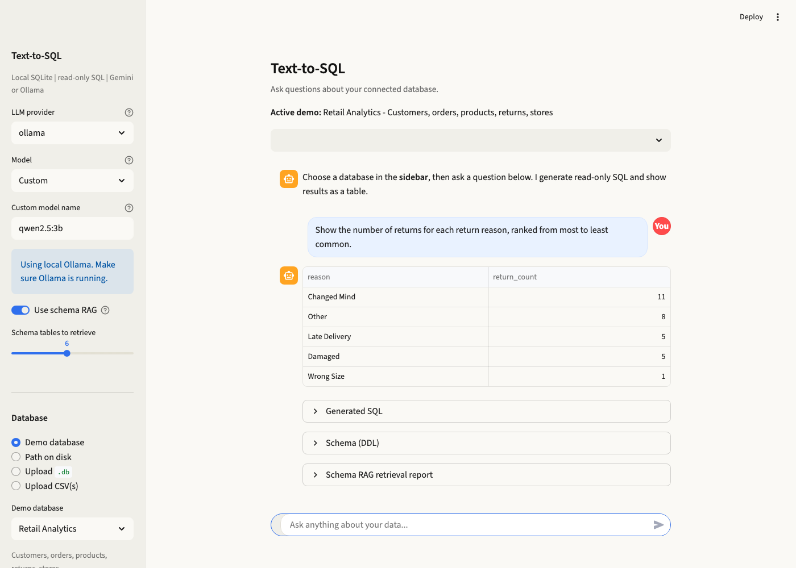
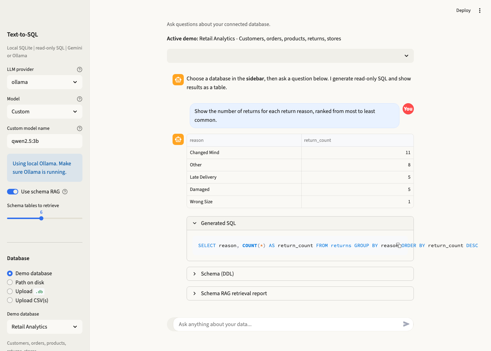
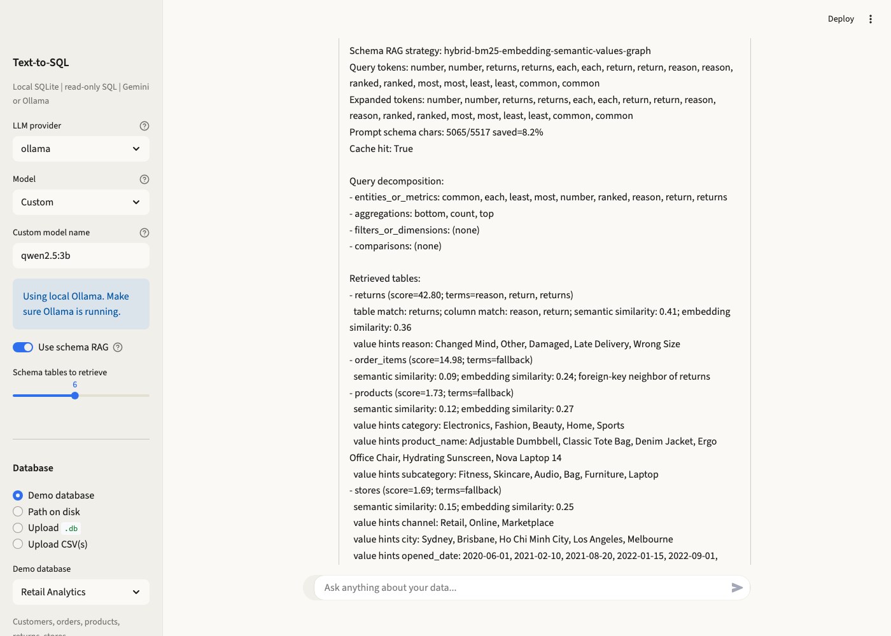
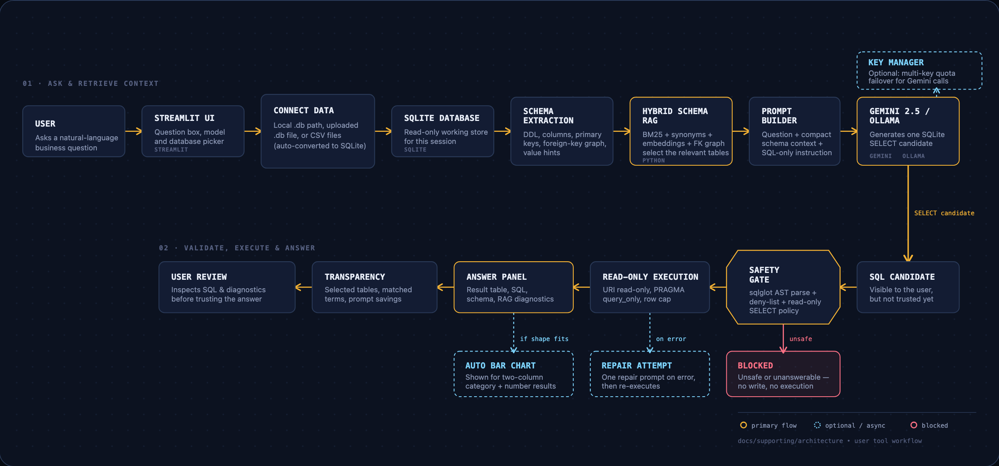

# Enterprise Text-to-SQL Agent

An AI-assisted decision support prototype that translates natural-language questions into safe, locally executed SQLite queries.

[](https://github.com/tuannm3812/aipa-text-to-sql-agent/actions/workflows/tests.yml)
[](https://aipa-text-to-sql-agent.streamlit.app/)
[](https://www.python.org/)
[](https://streamlit.io/)
[](https://ai.google.dev/)
[](https://ollama.com/)
[](https://www.sqlite.org/)
[](LICENSE)

**Live demo:** https://aipa-text-to-sql-agent.streamlit.app/

| Ask a question | Get a ranked, grounded answer |
|---|---|
|  |  |

<details>
<summary>See the generated SQL and the schema RAG retrieval report behind that answer</summary>

The SQL is never hidden from the user, and every answer can show which tables were retrieved and why:





</details>

## What It Does

The app lets a user connect a local SQLite database or upload CSV files, ask a plain-English question, and receive a table of results. The LLM only receives schema metadata, not raw database rows.

The current branch supports two LLM backends:

- Gemini API, using `GEMINI_API_KEY` or a multi-key failover set
- Local Ollama, using a model such as `gemma3`

## Architecture

1. Python extracts SQLite `CREATE TABLE` statements.
2. Schema RAG builds table-level chunks from DDL, columns, and foreign-key relationships.
3. The most relevant schema chunks are retrieved for the user question using hybrid lexical, semantic, and foreign-key graph signals.
4. The user question and retrieved schema are sent to the selected LLM.
5. The LLM returns one SQLite `SELECT` query.
6. Python validates that the SQL is read-only and avoids SQLite internals.
7. SQLite executes the query locally in read-only mode.
8. Streamlit renders the result table, with an automatic bar chart when the result is a two-column `GROUP BY`-shaped answer (one category column, one numeric column).



For a deeper, multi-page diagram (hybrid RAG internals, the offline evaluation workflow, and a module map), see `docs/diagrams/architecture.drawio` and `docs/2_architecture.md`.

## Schema RAG

The project includes an advanced local schema RAG layer. It does not read or embed row data. It only indexes:

- table names
- column names
- `CREATE TABLE` DDL
- foreign-key neighbor tables
- low-cardinality text value hints, such as status or grade categories

At question time, the backend:

1. tokenizes the user question
2. expands common business synonyms such as `client -> customer` and `revenue -> amount/sales`
3. scores schema chunks with a BM25-style lexical ranking
4. adds local hashed embedding similarity and character n-gram semantic similarity for fuzzy matching
5. adds privacy-safe categorical value hints for low-cardinality text columns
6. decomposes the question into entities, aggregations, filters, and comparisons for explainability
7. adds stronger boosts for exact table and column matches
8. expands through foreign-key neighbors so joinable tables are included
9. sends only the selected schema snippets to the LLM

This improves:

- prompt size for larger databases
- latency and cost
- table selection accuracy
- privacy, because only metadata is retrieved
- explainability, because selected tables, value hints, prompt savings, and schema recall are reported

In the Streamlit sidebar you can toggle schema RAG and adjust how many tables are retrieved. Each answer also includes an optional retrieval report showing selected tables, scores, matched terms, and graph-expansion reasons.

## Safety Model

- Generated SQL must start with `SELECT` or `WITH`.
- Data modification and schema-changing statements are blocked.
- Internal SQLite tables such as `sqlite_master` are blocked.
- SQL is parsed with `sqlglot` when available for AST-level read-only validation.
- SQLite is opened in read-only URI mode.
- `PRAGMA query_only = ON` is enabled during execution.
- A SQLite authorizer denies writes, DDL, transactions, attach/detach, pragmas, analyze, and reindex.
- Results are capped to avoid rendering unexpectedly large outputs.
- If safe generated SQL fails during execution, the system can make one LLM-based repair attempt using the SQLite error message.

## Inspiration From Text-to-SQL Research and BI Practice

The Holistics article ["Why is Text-to-SQL so hard?"](https://www.holistics.io/blog/text-to-sql/) argues that reliable Text-to-SQL is difficult because natural language is ambiguous, enterprise schemas are complex, and SQL is a strict execution language. It highlights semantic layers as a way to ground AI systems in governed business concepts, relationships, and metric definitions instead of asking a model to guess from raw table names.

Our prototype applies the same idea at assignment scale:

- The schema/RAG layer acts as a lightweight semantic layer over SQLite.
- Hybrid retrieval selects relevant tables, columns, foreign-key relationships, and safe categorical hints.
- The generated SQL is shown to users for verification.
- SQL execution is governed through read-only validation and local execution.

Unlike a full BI semantic layer such as Holistics AQL, our tool still generates SQL directly. The trade-off is that our prototype is simpler and flexible for arbitrary SQLite databases, but less governed than a production semantic-layer system with centrally defined metrics.

## Setup

```bash
python -m venv .venv
.venv\Scripts\activate
pip install -r requirements.txt
```

For Gemini, create `.env` in the project root:

```bash
GEMINI_API_KEY=your_api_key_here
TEXT_TO_SQL_PROVIDER=gemini
```

For Gemini quota failover, provide multiple keys either as a comma-separated list:

```bash
GOOGLE_API_KEYS=key_1,key_2,key_3
TEXT_TO_SQL_PROVIDER=gemini
```

or as indexed variables:

```bash
GOOGLE_API_KEY=key_0
GOOGLE_API_KEY_1=key_1
GOOGLE_API_KEY_2=key_2
TEXT_TO_SQL_PROVIDER=gemini
```

The Gemini manager rotates to the next key on `429` quota errors and `492` errors. On `503`, it retries the current key once before advancing. This runs in the shared LLM layer, so the Streamlit app, notebooks, and evaluation script all use the same failover behavior.

For local Ollama:

```bash
ollama pull gemma3
ollama serve
```

Then select `ollama` in the Streamlit sidebar.

## Run The App

```bash
streamlit run app.py
```

In the sidebar you can:

- choose Gemini or Ollama
- set the model name
- enable or disable schema RAG
- tune how many schema tables are retrieved
- use an existing `.db` path
- upload a SQLite `.db`
- upload one or more CSV files
- create the built-in university demo database

## Create Demo Data

```bash
python -c "import text_to_sql_agent as a; a.write_university_db('data/university_agent.db')"
```

## Run Tests

```bash
python -m unittest discover -s tests
```

## Run Evaluation

The evaluation harness compares generated SQL results with gold SQL results.
Use `gold` mode first to verify that the benchmark and databases are healthy:

```bash
python scripts/evaluate_text_to_sql.py --mode gold
```

Then run an LLM evaluation:

```bash
python scripts/evaluate_text_to_sql.py --mode llm --provider gemini --model gemini-2.5-flash
python scripts/evaluate_text_to_sql.py --mode llm --provider ollama --model gemma3
```

Outputs are written to `evaluation/results/` as CSV and Markdown summaries.
For Gemini free-tier testing, use a throttle or a smaller smoke test:

```bash
python scripts/evaluate_text_to_sql.py --mode llm --provider gemini --model gemini-2.5-flash --delay-seconds 15
python scripts/evaluate_text_to_sql.py --mode llm --provider gemini --model gemini-2.5-flash --max-cases 3
python scripts/evaluate_text_to_sql.py --mode llm --provider gemini --model gemini-2.5-flash --max-cases 3 --max-retries 2 --retry-base-seconds 30 --resume
```

## Project Structure

```text
.
|-- AGENTS.md                       # Agent operating rules and coding-standard pointers
|-- app.py                          # Streamlit frontend
|-- CLAUDE.md                       # Claude Code entrypoint (points to AGENTS.md)
|-- data/
|   |-- customers.csv               # Small CSV sample
|   |-- dynamic_agent.db            # Default CSV-ingestion output DB
|   |-- healthcare_analytics.db     # Healthcare sample DB
|   |-- retail_analytics.db         # Retail sample DB
|   |-- sales.csv                   # Small CSV sample
|   `-- university_agent.db         # Demo university DB
|-- docs/
|   |-- 0_coding_standards.md       # Project-specific rules and deliberate overrides
|   |-- 1_brief.md                  # What/for whom/done-looks-like/constraints
|   |-- 2_architecture.md           # Architecture notes and screenshots
|   |-- 3_decisions.md              # Dated decision log
|   |-- 4_next_steps.md             # Prioritised working view of the roadmap
|   |-- 5_deployment.md             # Streamlit Community checklist
|   |-- 6_agent_log.md              # Append-only record of agent work
|   |-- academic/                   # Course-assignment deliverables (report, slides)
|   |   |-- report.md                # Assignment report draft
|   |   |-- presentation.md          # Presentation transcript and slide content
|   |   `-- enterprise-text-to-sql-agent-presentation.pptx
|   |-- diagrams/                   # Diagram sources and exported figures
|   |   |-- architecture.drawio      # Multi-page diagram source (draw.io)
|   |   |-- architecture-workflow.html # Designed runtime-architecture schematic (open in a browser)
|   |   |-- architecture-workflow.excalidraw # Same diagram in Excalidraw's hand-drawn style
|   |   |-- architecture-rag-detail.png # Hybrid Schema RAG Detail export
|   |   |-- architecture-evaluation-workflow.jpeg # Offline Evaluation Workflow export
|   |   `-- architecture-implementation-modules.jpeg # Implementation Modules export
|   `-- screenshots/                # README screenshots
|-- evaluation/
|   `-- cases.json                  # Text-to-SQL benchmark cases
|-- pyproject.toml                  # Project metadata, dependencies, tool config
|-- requirements.txt                # Dependencies (generated with `uv export`)
|-- scripts/
|   `-- evaluate_text_to_sql.py     # Automatic model evaluation
|-- tests/                          # pytest suite (per-module files plus conftest.py)
|-- text_to_sql_agent/              # Backend package
|   |-- config.py                   # Defaults, model names, RAG constants
|   |-- data_setup.py               # Demo university database generation
|   |-- env.py                      # Environment loading
|   |-- execution.py                # Read-only SQLite execution
|   |-- ingestion.py                # CSV ingestion
|   |-- llm.py                      # Gemini/Ollama SQL generation
|   |-- gemini_manager.py           # Gemini API key loading and quota failover
|   |-- pipeline.py                 # End-to-end ask_* workflows
|   |-- rag.py                      # Hybrid schema RAG
|   |-- safety.py                   # SQL safety checks
|   |-- schema.py                   # Schema extraction/chunking
|   `-- types.py                    # Shared dataclasses
|-- text_to_sql_agent_mvp.ipynb     # Reproducible notebook walkthrough
`-- uv.lock                         # Locked dependency versions (uv)
```

## Evaluation Results

Evaluation was run against the 12-case benchmark in `evaluation/cases.json`.
The gold SQL baseline passed all cases, confirming that the benchmark queries and SQLite databases are valid:

```bash
python3 scripts/evaluate_text_to_sql.py --mode gold
```

| Baseline | Cases | Exact Result Match |
|---|---:|---:|
| Gold SQL | 12 | 12/12 |

Gemini was evaluated with `gemini-2.5-flash` and 10 configured API keys for quota failover:

```bash
python3 scripts/evaluate_text_to_sql.py --mode llm --provider gemini --model gemini-2.5-flash --max-cases 12 --max-retries 1 --retry-base-seconds 5
```

| Model | Safe SQL | Execution Success | Value Match, all cases | Value Match, executed only | Row Match | Exact Result Match | Avg Latency |
|---|---:|---:|---:|---:|---:|---:|---:|
| `gemini-2.5-flash` | 12/12 | 12/12 | 11/12 | 11/12 | 6/12 | 0/12 | 3.28s |

Earlier single-key Gemini testing hit `429 RESOURCE_EXHAUSTED` on 3 cases. After enabling the multi-key manager, the same 12-case run completed with 0 quota errors.

The same benchmark was also run with local Ollama models:

```bash
python3 scripts/evaluate_text_to_sql.py --mode llm --provider ollama --model llama3:latest --resume
python3 scripts/evaluate_text_to_sql.py --mode llm --provider ollama --model gemma4:latest --resume
```

| Model | Safe SQL | Execution Success | Value Match, all cases | Value Match, executed only | Row Match | Exact Result Match | Avg Latency |
|---|---:|---:|---:|---:|---:|---:|---:|
| `llama3:latest` | 12/12 | 12/12 | 8/12 | 8/12 | 5/12 | 0/12 | 3.78s |
| `gemma4:latest` | 10/12 | 10/12 | 8/12 | 8/10 | 3/12 | 0/12 | 5.65s |

Manual inspection showed that `exact_result_match` is intentionally strict. It requires matching result values, row order, and column names. Many exact-match failures were still analytically useful because the generated SQL returned the same values with different aliases, missing `ROUND()` formatting, or a different row order.

`Value Match, all cases` is the best headline metric for end-to-end reliability because blocked or failed SQL still counts against the model. `Value Match, executed only` is useful for judging SQL quality after the safety/execution layer has accepted the query. Under that second view, Gemma 4 reached 8/10, while Llama 3 reached 8/12.

For `llama3:latest`, 8 of 12 cases were value-correct. The 4 incorrect cases were:

- `retail_revenue_by_region`: ignored `discount_pct`, so completed revenue was too high.
- `retail_revenue_by_category`: ignored `discount_pct`, so completed revenue was too high.
- `retail_support_satisfaction_by_priority`: returned one overall average instead of grouping by priority.
- `healthcare_treatment_cost_by_city`: used an incorrect join/subquery and produced wrong city averages.

For `gemma4:latest`, 8 of 12 cases were value-correct. The 4 incorrect cases were:

- `university_average_score_by_course`: omitted `course_code`, changing the expected result shape.
- `retail_revenue_by_region`: generated an empty or blocked query.
- `retail_revenue_by_category`: generated truncated SQL that was blocked by the safety layer.
- `retail_support_satisfaction_by_priority`: grouped by priority but did not return the priority column.

Based on this run, the local-model choice depends on what we optimize for:

- `llama3:latest` is the stronger default for end-to-end reliability: it produced safe, executable SQL for every case, matched 8/12 values overall, and had lower average latency.
- `gemma4:latest` looks stronger among the queries it successfully executed: 8/10 executed queries were value-correct. However, it had two blocked SQL outputs on harder retail revenue questions, so its end-to-end value match remained 8/12.

For the deployed app, `llama3:latest` is the safer local default. For experimentation, Gemma 4 is worth revisiting after prompt or repair improvements because its accepted queries had a higher value-correct rate.

## Streamlit Community Cloud

For hosted deployment, use:

- Repository: `tuannm3812/aipa-text-to-sql-agent`
- Branch: `tuannm3812/main-refinement`
- Main file path: `app.py`
- Secrets: add `GEMINI_API_KEY`

See `docs/5_deployment.md` for the full checklist. Ollama is best treated as a local/offline demo option because Streamlit Community Cloud will not have access to your local Ollama server.

## Notes

This is still an MVP. The most important next improvements are persistent (model-based, not hashed) embedding retrieval for schema RAG, multi-attempt query repair instead of a single retry, and chart types beyond a bar chart (e.g. time series line charts) for result shapes the auto-chart heuristic doesn't cover yet.
